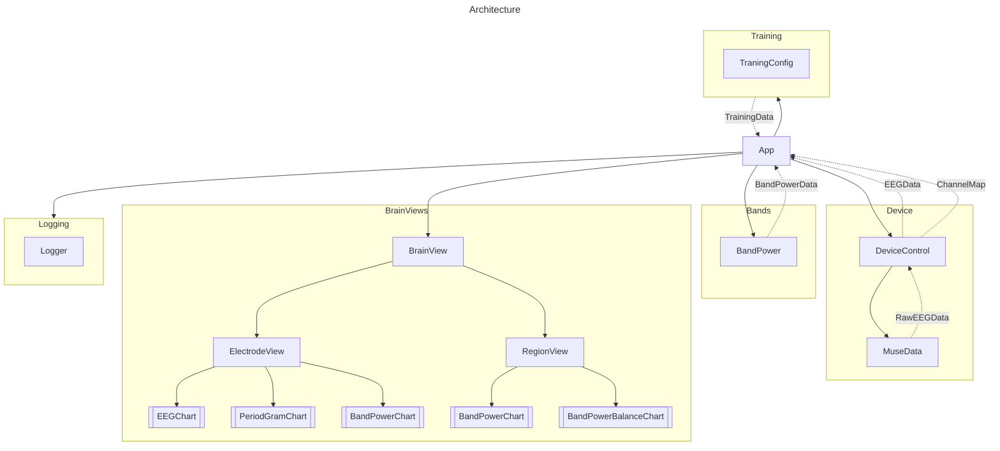

# General Overview

Supplementary documents: see `docs/design.md` for component responsibilities and data contracts, and `docs/requirements.md` for functional and non-functional goals.


## Key Components & APIs

All components will have a visual component.

### Device
**Device** components abstract and configure the hardware. 

The visual components allow for device configuration and connection.

Device Configuration is passed up, typically on configuration change.
```json
{
    "deviceType": <deviceinfo>,
    "locations": ["<location>","<location>"], 
    "sampleRate": <samplerate>
}
```

Raw eegData is passed up regularly typically once a second. This data should be as raw as 
possible, however filtering or time domain transient rejection could be implemented here.
```json
    [
        {
            "location": <location>,
            "eegData": [...]
        },
    ...
    ]
```

### BandPower

The visual components allow configuration of filtering, windowing or other frequency domain operations.

The BandPower components converts the raw EEG signals into periodograms via FFT, and then calculates 
absolute and relative band power for each electrode as well as averages across regions such as left/right/front left.  
Frequency domain filtering should happen within these components.

Band Power Information is passed up
```json
    [
        { 
            "location": <location | region>,
            "bands": [
                { 
                    "name": <band name>,
                    "absolutePower": [...],
                    "relativePower": [...],
                }
            ]
        }
    ]

```

### BrainView

The visual components allow for understanding what state different brain regions are at and understand region synchronicity

No Information is passed up

### Training

The visual components are training mode selection tools this could include
- bio feedback mechanism (sound/visual) possibly via plugins
- feedback tunables (aggressiveness, method) via plugins
- training targets (relative band powers, symmetry

The non-visual components do the training, feedback etc.

Training Information is passed up
```json
TBD
```

### Logging/Archiving
