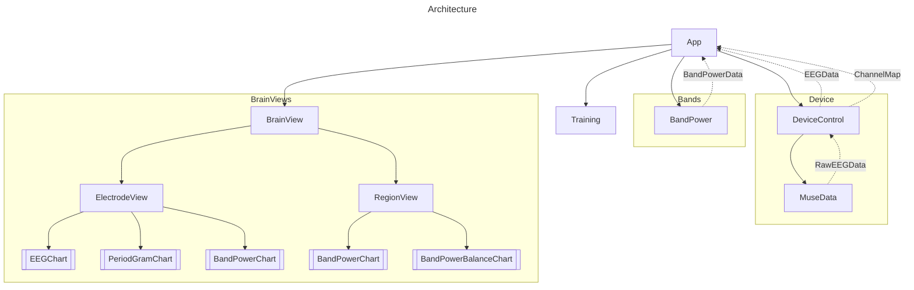

```mermaid
---
title: Architecture
---
graph TB
    App --> DeviceControl

    App --> BrainView
    App-->BandPower

    App --> Training

    
    subgraph Device
        DeviceControl-->MuseData
    end

    subgraph Bands
        BandPower
    end


    subgraph BrainViews
        EEGChart[[EEGChart]]
        PeriodGramChart[[PeriodGramChart]]
        ElectrodeBandPowerChart[[BandPowerChart]]
        RegionBandPowerChart[[BandPowerChart]]
        BandPowerBalanceChart[[BandPowerBalanceChart]]
        BrainView-->ElectrodeView
        ElectrodeView-->EEGChart
        ElectrodeView-->PeriodGramChart
        ElectrodeView-->ElectrodeBandPowerChart
        BrainView-->RegionView
        RegionView-->RegionBandPowerChart
        RegionView-->BandPowerBalanceChart

    end

    MuseData -.-> |RawEEGData|DeviceControl
    DeviceControl -.-> |EEGData|App
    DeviceControl -.-> |ChannelMap|App
    BandPower -.-> |BandPowerData|App

```