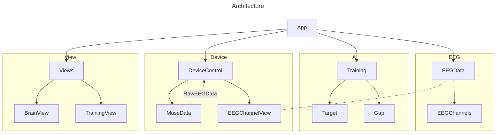

```mermaid
---
title: Architecture
---
graph TB
    App --> DeviceControl

    App-->Views

    App --> Training

    App --> EEGData

    subgraph EEG
        EEGData --> EEGChannels
    end

    subgraph A
        Training --> Target
        Training --> Gap
    end
    
    subgraph Device
        DeviceControl-->MuseData
        DeviceControl-->EEGChannelView
    end

    subgraph View
        
        Views-->BrainView
        Views-->TrainingView
    end

    MuseData -.-> |RawEEGData|DeviceControl

    EEGData -.- EEGChannelView
```