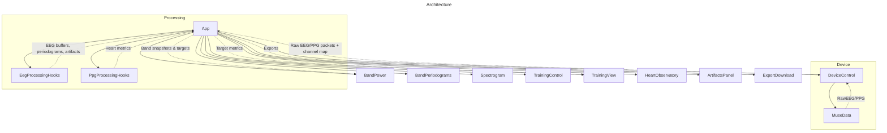

# General Overview

Supplementary documents: see `docs/design.md` for component responsibilities and data contracts, and `docs/requirements.md` for functional and non-functional goals.


## Key Components & APIs

All components have a visual component unless noted.

### Device
**Device** components abstract and configure the hardware.

The visual components allow for device configuration and connection.

Device configuration is passed up on configuration change.
```json
{
  "deviceType": "<deviceinfo>",
  "locations": ["<location>", "<location>"],
  "sampleRate": "<samplerate>"
}
```

Raw EEG/PPG data is passed up regularly (typically once a second). This data is as raw as
possible; artifact detection happens during processing.
```json
[
  {
    "location": "<location>",
    "eegData": [...]
  }
]
```

### Processing
`App` owns processing hooks that convert raw samples into FFT periodograms and artifact windows.
Artifacts are reported per electrode so UI overlays can indicate rejection windows.

### Band Power
`App` derives band snapshots from periodograms and `BandPower` visualizes the results with
target overlays and history.

```json
{
  "label": "<location>",
  "bands": {
    "alpha": { "absolute": 0.0, "relative": 0.0 }
  },
  "timestamp": 0
}
```

### Training
`TrainingControl` manages targets (relative or ratio), and `TrainingView` displays training state.
Audio feedback uses target distance and sensitivity to attenuate output.

```json
{
  "id": "<target-id>",
  "label": "<location|group>",
  "model": "relative|ratio",
  "target": 0.0,
  "tolerance": 0.0
}
```

### Logging/Archiving
Exports include BrainVision EEG plus BIDS sidecars that capture targets, target history, and
processing configuration for session analysis. Optional PPG TSV/sidecar is included when present.

## Development Patterns
- Processing stays in `App`-owned hooks; visual components consume derived state only.
- Rolling buffers are capped and windowed with explicit sample-rate conversions.
- Time-series visuals use the shared line chart component; bespoke SVGs are reserved for trace/overlay charts.
- Keep data contracts aligned with `docs/design.md` and `docs/requirements.md`.
